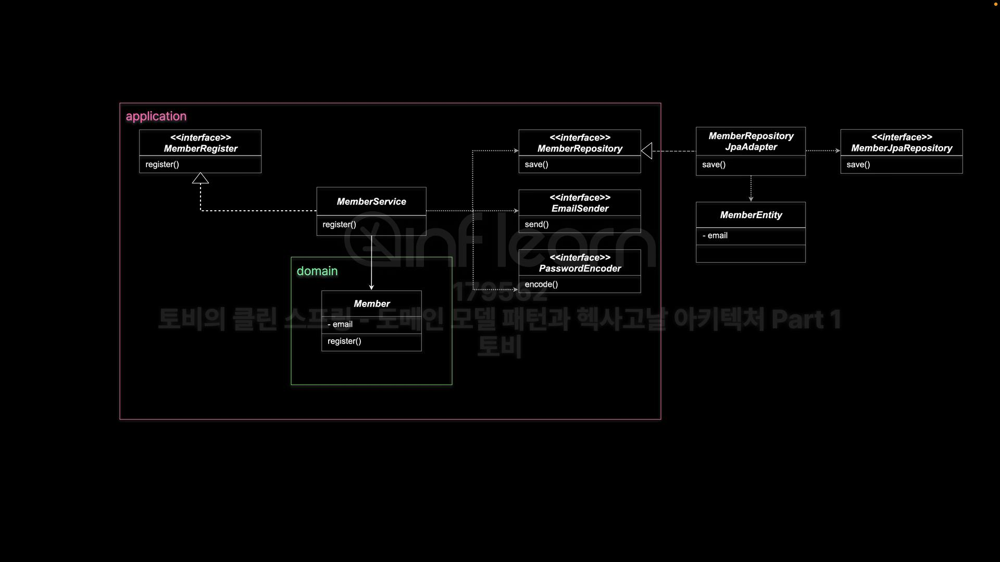

아키텍쳐
- 시스템의 기본적인 구조를 정의한다.
- 시스템의 중요한 품질 속성에 큰 영향을 미친다.
- 설계 결정의 기반이 되는 핵심적인 개념이다.
- 기본 구성 요소와 상화관계, 제약조건, 원칙 등을 포함하다.

계층형 아키텍쳐
- 서브 시스템을 계층으로 구조화 하는 아키텍쳐 스타일이다.
- 계층은 사용관계로 연결된다.
- 사용관계는 일반적으로 단방향이어야 한다는 핵심제약있음
    - 상위 계증이 하위계층의 서비스를 사용하는 하향식 흐름을 가진다.
- 각 계층이 하위 계층의 내부 작동 방식을 알지 못하고 제한된 인터페이스만 사용 하도록 한다.
- 어떤 레이어의 변경이 다른 레이어의 컴포넌트에게 가능한 영향을 주지 않도록 해야 한다.

3계층 아키텍쳐
- 요청 -> 처리 -> 아래 계층 -> 처리 -> 아래계층 -> 외부 시스템 요청
- 1계층 : UI (Presentation) - 사용자한테 입력받음
- 2계층 : DOMAIN (Business Logic) - 사용자한테 활동 관심사
- 3계층 : Data (Infra)

헥사고날 아키텍쳐
- 쉽게 변하지 않은, 중요한 도메인 로직을 담은 코어 어플리케이션
    - 도메인 로직을 가진 트랜잭션 스크립트
    - 도메인 모델 패턴을 따라서 만든 도메인
- 헥사곤과 상호작용하는 모든것 - 액터
- 사용자, 브라우저, CLI명령, 기계, 다른시스템
- 운영 환경, DB, 메시징 시스템, 메일시스템, 원격서비스
- 테스트

헥사고날 아키텍쳐의 특징과 혜택
- 테스트! 운영 시스템에 연결되지 않고 애플리케이션 테스트
- 애플리케이션과 상호작용하는 액터가 바뀌더라도 다시 빌드하지 않고 테스트
- UI 디테일이나 기술 정보가 도메인 로직 안으로 노출되지 않도록 보호한다.
- 컴포넌트를 각각 개발하고 연결하는 방식으로 큰 시스템을 분리 할 수 있다.
- 기술 요소를 제거했기 때문에 도메인 설계에 집중 할 수 있다.

JPA 모델과 도메인 모델은 다른것인가?
- 도메인 모델은 DB매핑되는 데이터 모델과 다르며 이를 분리해야한다.
  - 어댑터 계층에 JPA엔티티등의 모델을 따로 만들고
  - 레포지토리를 구현한 어댑터를 이용해서 도메인 오브젝트와 JAP오브젝트를 매핑해준다
  - Member 외에 MemberEntity 클래스를 만들어 JPA관련 설정은 모두 이곳으로 옮긴다
  - Member레포지토리를 구현한 MemberRepositoryJpaAdapter에서 이 두가지 오브젝트를 서로 매핑해주는 코드 작성

도메인 모델과 JPA모델을 분리하는 방법을 선호하는 이유
- 데이터 모델과 도메인 모델이 너무 다른경우
  - 레거시 DB에 도메인 모델 설계를 적용하는 경우
- 복잡한 도메인 모델이 데이터 모델과 간단히 매핑되지 않은 경우
  - JPA 모델과는 다른 도메인 모델이 존재한다면
- 데이터 저장 기술이 바뀌는 경우
  - Spring Data 프로젝트 존재 이유
- 코드에 등장하는 JPA 애노테이션은 기술 의존적이니까
  - 애노테이션 코드의 실행에 영향을 줄까
- 도메인 코드에 관심사가 다른 JPA매핑 애노테이션, DB정보가 들어가니까

JPA 기술의 정체성
- ORM : 패러다임이 다른 관계형 DB와 객체지향 모델의 불일치를 해결 하는 기술
  - SQL 매핑과는 다르다 ex) MyBatis
- JPA의 기술적 목표는 자바 애플리케이션 개발자가 관계형 DB를 관리하기 위해 자바 도메인 모델을 활용할 수 있는 객체/관계 매핑 기능을 제공
- JPA 엔티티는 경량 영속 도메인 오브젝트

도메인 모델 패턴
- 단순 도메인 모델은 테이블과 클래스가 1:1로 매핑된다
- 복잡한 도메인 모델은 DB매핑이 어렵다는 문제가 있다
  - 이걸 해결해주는것이 JPA 기술
- JPA이 매핑을 통해서 해결하려는 패러다임 불일치 문제
  - 세분성 불일치 : DB와 클래스가 1:1이 아닌, 엔티티 안에 여러개의 클래스가 존재할경우
  - 상속 불일치
  - 정체성 불일치 
  - 연관 불일치
  - 데이터 탐색 불일치

스프링 데이터 프로젝트
- 다양한 데이터 저장소에 대한 데이터 접근을 단순하고 일관된 프로그래밍 모델로 제공
  - 일관된 프로그래밍 모델 : 저장소의 종류와 관계없이 동일한 방식으로 데이터에 접근하도록 한다.
  - 보일러 플레이트 코드 감소 (반복적인 코드)
  - 데이터 저장소의 특성 유지
  - 확장성과 유연성
- Repository<T, ID>
  - T : 도메인 타입 = 엔티티 = 애그리거트 루트

도메인 모델과 JPA모델을 반드시 분리해야 한다는 주장에 대한 반박
- 대부분 데이터 모델과 도메인 모델이 다르지않음
- 복잡한 도메인 모델의 매핑은 JPA가 충분히 지원
- 모델 변환 로직과 유사한 두가지 클래스로 인한 불필요한 복잡성 증가
- JPA는 근본적으로 도메인 오브젝트의 매핑을 위해서 설계된 기술
- JPA는 도메인 계층을 침범하지 않음
- 복잡한 쿼리 로직은 커스톰 리포지토리와 어댑터 구현을 통해서 개발 가능
- 도메인 계층과 데이터 계층의 결합은 불가피하다
  - 이 둘이 완전히 독립적인 경우는 매우 드물다

